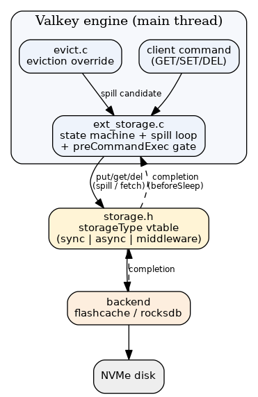

# Data Tiering — Overview

> Data tiering keeps every key in the dict and spills only its *value*
> to external storage (flash), so keyspace metadata operations never touch disk.
> Eventually key-spilling can be supported, but v1 is scoped to retaining keys in memory.

## Mental model

When memory exceeds `maxmemory`, the engine picks cold values and writes them to a flash
backend, replacing the in-memory value with a lightweight tiered marker
(`OBJ_ENCODING_TIERED`, empty SDS placeholder). The key, its type, and TTL stay in RAM.
A later access transparently fetches the value back, blocking the client until it lands.
See [01-architecture](01-architecture.md) for the moving parts and [state-machine](components/state-machine.md) for the
per-key lifecycle.

## Key semantics (what stays in memory)

The key, its type, and TTL stay in the dict, so the keyspace is fully present in RAM. But the
spill gate is **value-agnostic**: any command that names a key in `ONLY_FLASH` blocks and
fetches the value first (`preCommandExec` → `keyBlocksClient`, `ext_storage.c:288-526`),
regardless of whether the command actually needs the value.

| Operation on a tiered (`ONLY_FLASH`) key | Behaviour |
|------------------------------------------|-----------|
| `SCAN` / `DBSIZE` / `KEYS` | include the key, **no fetch** (keyspace iteration doesn't name a key to the gate) |
| `DEL` / `UNLINK` | async delete from flash, **no fetch** ([delete](flows/delete.md)) |
| `GET` / `SET` / `EXISTS` / `TYPE` / `TTL` / `EXPIRE` / any single-key command | **block + fetch** the value, then execute |

Because the key never leaves the dict, v1 avoids the bloom filter that key-spilling would need
to answer key-existence, and `SCAN`/`DBSIZE`/`DEL` never touch flash. **This wiki documents the
v1 (value-only) design.**

> ⚠️ CONTRADICTION: `DATA-TIERING.md` describes metadata commands (`EXISTS`/`TYPE`/`TTL`) as
> answerable from RAM with no fetch — the intended payoff of keeping keys in the dict. The
> current POC does **not** implement that: the `preCommandExec` gate fetches the value for any
> named tiered key. Code wins; tracked in [known-limitations](decisions/known-limitations.md).

## When it helps

Initial target workloads (see `design-docs/data-tiering/workload-targets.md`):

- Small string values (< ~2 KB) — break-even is roughly value size > the per-tiered-key
  overhead (~82 + key_len bytes; see [memory-accounting](components/memory-accounting.md)).
- Zipfian / power-law access with a stable hot set — the hot set stays in RAM, only the
  cold tail spills. (Benchmarks: Zipfian tiering ≈ uniform-RAM throughput; uniform random
  is the worst case.)

## Where to go next

- [01-architecture](01-architecture.md) — components, threads, event loop.
- [state-machine](components/state-machine.md) — the 5 states.
- [spill](flows/spill.md) / [fetch](flows/fetch.md) — the two core data paths.
- [known-limitations](decisions/known-limitations.md) — current constraints (string-only history,
  restart loss, compound-type work).
