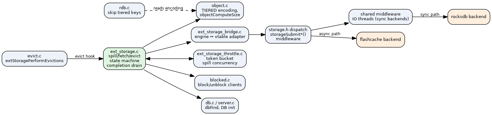
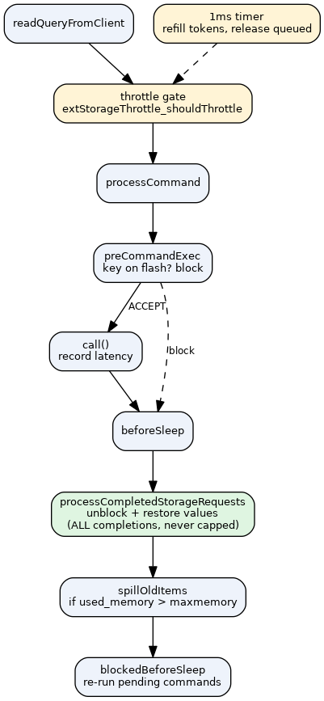

# Data Tiering — Architecture

> The engine runs the state machine and spill/fetch decisions on the main thread; the
> backend does disk I/O on its own thread(s); they communicate through a completion queue
> drained in `beforeSleep`.

## Component map

| Component | File | Role |
|-----------|------|------|
| Engine integration | `src/ext_storage.c` | spill loop, `preCommandExec` gate, completion drain, state machine | → [engine-integration](components/engine-integration.md) |
| State machine | `src/ext_storage.h` | 5 states stored in `robj->tiering_state` | → [state-machine](components/state-machine.md) |
| Bridge | `src/ext_storage_bridge.{c,h}` | adapts engine calls to the `storageType` vtable | → [bridge-layer](components/bridge-layer.md) |
| Pluggable storage API | `src/storage/storage.h` | `storageType` vtable; sync, async, or shared-middleware dispatch | → [pluggable-storage-api](components/pluggable-storage-api.md) |
| Throttle | `src/ext_storage_throttle.{c,h}` | token-bucket client throttle + spill concurrency | → [throttle-equilibrium](components/throttle-equilibrium.md) |
| Eviction | `src/evict.c` | `extStoragePerformEvictions` override, spill-pool LRU | → [eviction-integration](components/eviction-integration.md) |
| Backends | `modules/`, `src/storage/` | bridge selects async backends (real flashcache, async rocksdb); sync+middleware variant exists but is unwired | → [backends](components/backends.md) |

Engine touch-points: `object.c` (`OBJ_ENCODING_TIERED`, sizing), `rdb.c` (skip tiered),
`defrag.c` (skip tiered), `blocked.c` (client block/unblock), `db.c`/`server.c`.

## Threading model

- **Main thread:** command dispatch, `preCommandExec` blocking decisions, state
  transitions, eviction candidate selection, throttle decisions, and draining completions
  (restoring fetched values into the dict).
- **Backend IO thread(s):** the actual flash reads/writes **and** value serialize/deserialize
  (RDB DUMP via `createDumpPayload`/`rdbLoadObject`). Async backends own their own
  IO (`*_async` + `poll_completions`); sync backends (rocksdb) are wrapped by the shared
  middleware. See [pluggable-storage-api](components/pluggable-storage-api.md) and [serialization](components/serialization.md).
- **Hand-off:** main → backend via `storageSubmit{Put,Get,Del}`; backend → main via a
  completion queue polled in `beforeSleep`.

## Event-loop integration

Each iteration: read → throttle gate → `processCommand` → `preCommandExec` (block if the
key is tiered/in-flight) → `call()` → `beforeSleep` drains **all** completions (never
capped), spills if over `maxmemory`, and re-runs unblocked commands. A 1 ms timer refills
throttle tokens and releases queued clients.

## Equilibrium

Memory is held near `maxmemory` by a feedback loop: pressure raises `throttle_rate`, which
both slows client intake and speeds up spill concurrency. See
[throttle-equilibrium](components/throttle-equilibrium.md).

## Core data paths

- [spill](flows/spill.md) — memory → flash
- [fetch](flows/fetch.md) — flash → memory (with client blocking)
- [delete](flows/delete.md) · [evict-during-fetch](flows/evict-during-fetch.md) · [completion-drain](flows/completion-drain.md)
