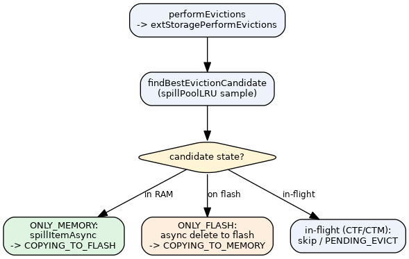

# Eviction Integration

> When over `maxmemory`, `performEvictions` **short-circuits into the tiering path and never
> runs the destructive normal eviction loop** — for NKS, freeing memory means spilling to flash
> and waiting for the write completion, not deleting keys. Two pieces: a spill pool (LRU
> sampling of *spillable* keys) and an eviction override (decides OK vs OOM).

## The performEvictions hook (`evict.c:543-557`)

If `ext_data_enabled`, `performEvictions` calls
`processCompletedStorageRequestsAndSpillOldItemsAggressive()` (`:545`) then
`extStoragePerformEvictions(&ts_result)` (`:551`), sets `result` to `EVICT_OK`/`EVICT_FAIL`,
and `goto update_metrics` (`:556`) — skipping the normal loop. The normal loop
(`findBestEvictionCandidate(EvictionPoolLRU,…)` + `dbGenericDelete`, `:563+`) runs **only** when
tiering is disabled. See [engine-integration](engine-integration.md) and the
[spill flow](../flows/spill.md).

## Spill pool & candidate selection

The spill loops draw candidates from `spillPoolLRU` (allocated in `extStorage_init`,
`ext_storage.c:304`) via `findBestEvictionCandidate(spillPoolLRU,…)`. That function
(`evict.c:378`) is **shared** with normal eviction — the normal path passes `EvictionPoolLRU`
(`evict.c:563`), the spill path passes `spillPoolLRU`. It samples keys across all DBs into the
pool with `evictionPoolPopulate` (`evict.c:105`, called at `:409`), ordered by idle/score.

**Spillable-only gate** (`evict.c:120`): while `ext_storage_spill_pool_active`,
`evictionPoolPopulate` skips any sampled key whose `tiering_state != TIERING_STATE_ONLY_MEMORY`,
so the spill pool only collects keys that can actually be spilled (not in-flight/tiered ones).

## Eviction override (`extStoragePerformEvictions`, `ext_storage.c:938-983`)

Returns 1 (handled) and sets `*result`. The over-budget decision is made on **projected**
memory (a Smith predictor — `used_memory` minus spill RAM already committed-to-be-freed; see
[memory-accounting](memory-accounting.md)); only the hard OOM cap reads raw `used_memory`:

| Condition | Result |
|-----------|--------|
| `extStorageProjectedMemory() <= maxmemory` | `C_OK` (`ext_storage.c:945-948`) |
| `used_memory > maxmemory + maxmemory/5` (1.2× hard cap) | `C_ERR` + `oom_reject_write_count++` (`ext_storage.c:952-956`) |
| in-flight spills (`total_items_spilling > 0`) | `C_OK` (`ext_storage.c:961-964`) |
| `total_keys > num_items_on_flash` (spillable items remain) | `C_OK` (`ext_storage.c:973-976`) |
| else (nothing left to spill) | `C_ERR` (`ext_storage.c:981-982`) |

The first row is the load-bearing change: gating on projected memory lets the override report
`C_OK` as soon as enough drain has been *committed* (submitted/in-flight), without waiting for
the asynchronous completions to actually free RAM — the spill dead-time is predicted, not
observed. The "nothing left to spill" `C_ERR` is the key-in-RAM-floor OOM — see
[known-limitations](../decisions/known-limitations.md).

## Evicting a key already on flash (`extStorageEvictFlashKey`, `ext_storage.c:880-912`)

Async DELETE with **no fetch**: `ONLY_FLASH → COPYING_TO_MEMORY` (delete in-flight); if a fetch
is already in-flight it becomes `PENDING_EVICT`; other states return -1. Same path as the
[delete flow](../flows/delete.md). FlashCache's own internal GC eviction surfaces through the
[bridge](bridge-layer.md)'s `req_ctx == NULL` branch as a synthetic DELETE.

## The spill controller is cap-less (`spillFillToProjected`, `ext_storage.c:1009-1046`)

There is **no fixed concurrency cap**. The unified spill controller `spillFillToProjected`
submits spills in a loop `while (extStorageProjectedMemory() > server.maxmemory)`
(`ext_storage.c:1024`), drawing candidates from `findBestEvictionCandidate(spillPoolLRU,…)`
(`ext_storage.c:1027`). Queue depth is an **emergent output** of the projected-memory signal,
not a prescribed constant. The loop stops on exactly three conditions: setpoint reached
(`projected <= maxmemory`), no spillable candidate left (`spill_skipped_null`,
`ext_storage.c:1028`), or the submit queue rejects (`spillItemAsync == -1` backpressure,
`ext_storage.c:1039`). It deliberately has **no memory-headroom clamp** — halting on memory
pressure would starve the disk and *raise* memory (only completions free RAM); disk saturation
is handled implicitly by the [throttle](throttle-equilibrium.md), which reads raw `used_memory`.

> The old throttle-driven `extStorageUpdateSpillConcurrency` and the fixed
> `SPILL_CONCURRENT_BASE`/LIMIT cap (`max_num_concurrent_items_spilled`) were **removed** by the
> Smith-predictor commit (removal comment `ext_storage.c:100-104`). The spill and throttle
> controllers are now decoupled — they communicate only implicitly through memory. (This also
> retires the former `SPILL_CONCURRENT_BASE` comment-vs-`#define` contradiction; the `#define` no
> longer exists.)
>
> ⚠️ CONTRADICTION: the `items_spillover_batch_size` variable (`ext_storage.c:95`) and its
> `ext-storage-items-spillover-batch-size` config directive (`config.c:3426`) still exist but are
> now **unused** — the cap-less loop never reads them. Dead config; folded into
> [known-limitations](../decisions/known-limitations.md).

See also: [spill](../flows/spill.md), [engine-integration](engine-integration.md), [memory-accounting](memory-accounting.md), [ext-storage-api](../interfaces/ext-storage-api.md).
