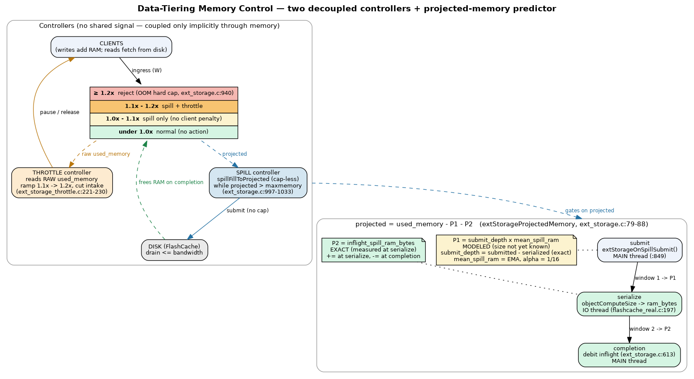

# Memory Accounting

> A spilled key stays in the dict; its value is replaced by an **empty SDS placeholder** and the
> object is marked `OBJ_ENCODING_TIERED`. So a tiered key still costs RAM — the robj shell, the
> empty placeholder, the dict/hashtable entry, and the key itself — which is the per-key floor
> that bounds how much memory NKS can reclaim.

## The tiered marker

- `OBJ_ENCODING_TIERED = 15` (`server.h:779`) — "Value is on external storage (non-key-spilling)".
- `objectIsTiered(o)` ≡ `o->encoding == OBJ_ENCODING_TIERED` (`server.h:839`).
- `robj.tiering_state` is a separate 3-bit bitfield holding the [state machine](state-machine.md)
  value (`server.h:829`).

On a successful spill the WRITE completion frees the real value by its true type, sets
`encoding = OBJ_ENCODING_TIERED`, installs an empty placeholder via
`objectSetVal(entry, sdsnewlen("", 0))`, and bumps `num_items_on_flash`
(`ext_storage.c:672-675`). See [spill](../flows/spill.md).

> ⚠️ CONTRADICTION: `server.h:838` comments that a tiered entry's "val_ptr is NULL (value on
> disk)", but the code uses a **non-NULL empty SDS placeholder** — confirmed by
> `objectComputeSize` (`object.c:1206-1212`) and `decrRefCount` (`object.c:632-634`), which both
> read/free it as an empty sds. The code (empty sds) wins; the comment is stale.

## Sizing (`objectComputeSize`, `object.c:1202-1212`)

A tiered object short-circuits: `asize = zmalloc_size(robj) + sdsAllocSize(placeholder)` — i.e.
the robj shell plus the empty placeholder, **not** the on-flash value. `decrRefCount`
(`object.c:629-640`) likewise frees a tiered entry by `sdsfree`ing the placeholder rather than
running the type-specific free.

## The per-key RAM floor

Because keys, robj shells, and placeholders never leave RAM, spilling reclaims only the *value
payload*. For small values the fixed per-tiered-key overhead dominates (the rough
~82 + `key_len` bytes estimate in [00-overview](../00-overview.md)), so a key-heavy workload hits
a floor that spilling can't push past. When `DBSIZE <= num_items_on_flash` (everything spillable
is already on flash), the [eviction override](eviction-integration.md) returns `C_ERR` → OOM.
Detail: [known-limitations](../decisions/known-limitations.md).

## Projected memory (the Smith predictor)

Spills are asynchronous, so RAM is only reclaimed when the WRITE completion runs — there is a
**dead-time** between deciding to spill and the memory actually dropping. To avoid over- or
under-submitting during that window, the spill controller does not gate on raw `used_memory`; it
gates on `extStorageProjectedMemory()` (`ext_storage.c:79-88`):

```
projected = used_memory − inflight_spill_ram_bytes − (submit_depth × mean_spill_ram)
```

This is a **two-stage Smith predictor** over the life of a spilled value (submit → serialize →
completion):

| Term | Window | Exact? | How it is maintained |
|------|--------|--------|----------------------|
| `inflight_spill_ram_bytes` | serialize → completion | **exact** | IO thread adds the value's measured footprint at serialize (`extStorageInflightAddRam`, `ext_storage.c:46-48`); main thread subtracts the same number on WRITE completion (`:625`) |
| `submit_depth × mean_spill_ram` | submit → serialize | **modeled** | `submit_depth = spill_submitted_count − spill_serialized_count` (exact integer); `mean_spill_ram` is an EMA (α = 1/16) of measured footprints (`ext_storage.c:42-71`) |

`extStorageOnSpillSubmit()` (`ext_storage.c:52-54`) increments `spill_submitted_count` on the
**main thread** at submit, so `projected` drops in real time *inside* the cap-less spill loop —
this is what brakes a within-loop submission burst. `extStorageOnSpillSerialize(bytes)`
(`:61-71`) runs on the **IO thread**: it increments `spill_serialized_count` (migrating the item
from window-1 to window-2) and folds the exact footprint into the EMA. All counters are
single-writer monotonic atomics. The footprint itself is computed by `objectComputeSize` on the
IO thread during serialize (`storage_flashcache_real.c:197`), off the main thread, and carried
back on the completion msg as `ram_bytes` so the add and subtract use the identical value (no
drift).

> The Smith predictor replaced the former fixed spill-concurrency cap
> (`SPILL_CONCURRENT_BASE`/`LIMIT`): queue depth is now an emergent output of `projected`, not a
> constant. See [eviction-integration](eviction-integration.md) and the [spill flow](../flows/spill.md).
> Cold-start caveat (mean is 0 until the first serialize) is logged in
> [known-limitations](../decisions/known-limitations.md).



## Overshoot

Because RAM frees only on completion, raw `used_memory` overshoots `maxmemory` during the spill
window even while `projected` is already at setpoint. The two controllers split this band: the
**spill** controller owns `[1.0×, 1.1×]` (it targets `maxmemory` on *projected* memory, no client
penalty), and the **throttle** engages only across `[1.1×, 1.2×]` reading *raw* `used_memory`
([throttle-equilibrium](throttle-equilibrium.md)); the [eviction override](eviction-integration.md)
hard-rejects writes at `1.2×`. The gap `used_memory − projected` is the in-flight spill backlog,
which doubles as the implicit disk-saturation signal coupling the two otherwise-decoupled
controllers.

See also: [00-overview](../00-overview.md), [eviction-integration](eviction-integration.md), [spill](../flows/spill.md), [state-machine](state-machine.md).
