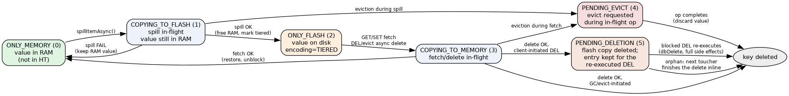

# Tiering State Machine

> Each key is in one of **6** states, stored in `robj->tiering_state` (a 3-bit field holding
> 0–5, `src/server.h:824`). `ONLY_MEMORY` is the implicit default: it is the zero value of the
> bitfield and is **not** tracked in any side table — the old `keys_tiering_state` hashtable
> was removed (`src/server.h:913`), and `extStorageGetState` simply reads the bitfield off the
> dict entry, returning `ONLY_MEMORY` for keys it cannot find (`src/ext_storage.c:179-185`).

## States

Source: `TieringState` enum in `src/ext_storage.h:25-35`.

| State | Value | Meaning |
|-------|-------|---------|
| `ONLY_MEMORY` | 0 | Value in RAM, normal operation (default, untracked) |
| `COPYING_TO_FLASH` | 1 | Spill in-flight; value still in RAM (still serveable for reads) |
| `ONLY_FLASH` | 2 | Value on disk; `encoding == OBJ_ENCODING_TIERED` |
| `COPYING_TO_MEMORY` | 3 | Fetch **or** async-delete in-flight |
| `PENDING_EVICT` | 4 | Eviction requested while an op was in-flight; value will be discarded |
| `PENDING_DELETION` | 5 | Flash copy **already deleted** for a client `DEL`/`UNLINK`; the TIERED placeholder entry is deliberately retained so the re-executed command performs the keyspace removal with full command-layer side effects |

> ⚠️ The enum's own header comment (`src/ext_storage.h:21-22`) still says "one of 5 states"
> and still refers to the removed `keys_tiering_state` hashtable. Two stale code comments,
> flagged not fixed — the wiki does not edit raw sources.

## Transitions

| From | Event | To |
|------|-------|-----|
| ONLY_MEMORY | `spillItemAsync()` submit accepted (`src/ext_storage.c:1222-1224`) | COPYING_TO_FLASH |
| COPYING_TO_FLASH | spill OK (free RAM, tombstone entry as tiered) (`src/ext_storage.c:797-821`) | ONLY_FLASH |
| COPYING_TO_FLASH | spill FAIL (keep RAM value) (`src/ext_storage.c:791-796`) | ONLY_MEMORY |
| COPYING_TO_FLASH | backend DELETE completion arrives mid-spill (`src/ext_storage.c:965-971`) | PENDING_EVICT |
| ONLY_FLASH | GET/SET → `submitGet`; DEL/UNLINK (or expired-TTL read) → `submitDel` (`src/ext_storage.c:709-724`) | COPYING_TO_MEMORY |
| ONLY_FLASH | `extStorageEvictFlashKey()` → `submitDel` (`src/ext_storage.c:1243-1252`) | COPYING_TO_MEMORY |
| COPYING_TO_MEMORY | fetch OK (restore value, unblock) (`src/ext_storage.c:923`) | ONLY_MEMORY |
| COPYING_TO_MEMORY | eviction arrives (`src/ext_storage.c:1256-1258`) | PENDING_EVICT |
| COPYING_TO_MEMORY | DELETE completion, delete was **client-initiated** (`src/ext_storage.c:995-1004`) | **PENDING_DELETION** |
| COPYING_TO_MEMORY | DELETE completion, delete was GC/eviction-initiated (`src/ext_storage.c:1006-1009`) | *key deleted* |
| COPYING_TO_MEMORY | DELETE/READ completion and the key's TTL has expired (`src/ext_storage.c:991-993`, `src/ext_storage.c:864-878`) | *key deleted* (expiry propagation path) |
| PENDING_EVICT | fetch or spill completes (discard value, `dbDelete`) (`src/ext_storage.c:776-788`, `src/ext_storage.c:837-853`) | *key deleted* |
| **PENDING_DELETION** | the blocked `DEL`/`UNLINK` re-executes and `dbDelete`s the entry (`src/db.c:490-535`) | *key deleted* |
| **PENDING_DELETION** | orphan path: deleting client vanished, next toucher finishes the delete inline (`src/ext_storage.c:507-522`) | *key deleted* |

`PENDING_DELETION` is **terminal**: there is no edge out of it back into any other tiering
state. Its flash copy is already gone (`num_items_on_flash` was decremented in the same
DELETE completion) and its entry is a TIERED placeholder with no value to fetch — the only
way out is removal of the key.

Two readers observe `PENDING_DELETION` without changing it:

- `extStorageSyncFetch` treats it as **absent** and returns immediately
  (`src/ext_storage.c:1096`) — a Lua/EXEC/SORT/module lookup of a key whose DEL is draining
  sees the key as already gone.
- `extStorageMaterializeTiered` **skips** it during a snapshot (`src/ext_storage.c:1787-1791`),
  so an RDB written while a DEL drains does not resurrect the key.

## Blocking matrix

`keyBlocksClient()` (`src/ext_storage.c:460-544`) decides this per key, per command.
`is_delete_cmd` is true only for `DEL` and `UNLINK` (`src/ext_storage.c:654`).

| Command | ONLY_MEMORY | COPYING_TO_FLASH | ONLY_FLASH | COPYING_TO_MEMORY | PENDING_EVICT | PENDING_DELETION |
|---------|-------------|------------------|------------|-------------------|---------------|------------------|
| GET | serve RAM | serve RAM (still there) | block + fetch | block | block | **block** until the DEL drains, then serve the post-delete keyspace (nil) |
| SET | normal | block (wait for spill) | block + fetch | block | block | **block**, then create a fresh key |
| DEL / UNLINK | normal | block (wait for spill) | block + async delete | block | block | **pass through** — performs the real `dbDelete` + reply/WATCH/notify/`dirty++` |
| Eviction | free | skip (in-flight) | async delete | → PENDING_EVICT | already pending | **refused** — `extStorageEvictFlashKey` falls to `default` and returns −1 (`src/ext_storage.c:1267-1270`); the spill pool is filtered to ONLY_MEMORY (`src/ext_storage.c:1179`, `src/ext_storage.c:1406`) so it is never a spill candidate either |

The `PENDING_DELETION` block is released by the delete itself, not by a completion: when the
re-executed `DEL` removes the entry, `dbGenericDeleteWithDictIndex` notices the state it
captured before removal and calls `unblockClientsInUseOnKey` (`src/db.c:499`, `src/db.c:534`).

## PENDING_EVICT (4) vs PENDING_DELETION (5)

Easy to confuse — same "pending" naming, opposite ownership and opposite policy:

| | `PENDING_EVICT` (4) | `PENDING_DELETION` (5) |
|---|---|---|
| Who asked | The engine / backend GC — capacity pressure | A client, via `DEL` or `UNLINK` |
| Flash copy | May still exist; the op that is in flight still owns it | **Already deleted** |
| Is anyone owed a reply? | No | **Yes** — a blocked client must still get `1` |
| Why the state exists | Avoid fetch-just-to-evict thrash: discard the value on completion instead of promoting it | Preserve command-layer side effects: reply count, `signalModifiedKey` (WATCH), keyspace `"del"` notification, `dirty++` |
| Entered from | COPYING_TO_FLASH or COPYING_TO_MEMORY | COPYING_TO_MEMORY only, and only when the in-flight delete was client-initiated |
| `DEL` behaviour | Blocked like everything else | **Allowed through** — it is the thing that finishes the state |
| Who removes the key | The completion handler, inline | The re-executed client command (or the orphan-recovery path) |

## Design notes

- **GET during COPYING_TO_FLASH serves from RAM** — the value is still present until the
  spill completion frees it. `keyBlocksClient` re-checks the encoding first and self-heals a
  stale `COPYING_TO_FLASH` state whose completion already landed (`src/ext_storage.c:472-487`).
- **SET/DEL during COPYING_TO_FLASH block** — must not mutate an in-flight value.
- **`PENDING_EVICT`** avoids the fetch-just-to-evict thrash: when an in-flight fetch
  finishes for a key already chosen for eviction, the value is discarded and the key
  deleted rather than promoted. See [evict-during-fetch](../flows/evict-during-fetch.md).
- **`PENDING_DELETION` exists because the optimized (no-fetch) delete used to reply `0`.**
  The completion removed the entry itself, so the re-executed `DEL` found nothing: wrong
  reply, no WATCH invalidation, no keyspace notification, no `dirty++`. Regression suite:
  tests/unit/data-tiering/ext-storage-del-semantics.tcl.
- **Orphan recovery.** If the deleting client disconnects before its command re-executes,
  the placeholder would wedge every other command on that key forever. `keyBlocksClient`
  therefore asks `blockedInUseClientWithPendingDeleteExists` (`src/blocked.c:951-962`) whether
  a blocked `DEL`/`UNLINK` still exists for the key; if not, it finishes the deletion inline
  with the side effects the client would have produced and lets the current command proceed
  (`src/ext_storage.c:509-522`).
- **`PENDING_DELETION` is exempt from the TIERED-after-`preCommandExec` safety check**
  (`src/server.c:4756-4775`). That check re-runs `preCommandExec` when it finds a TIERED key
  the filter had accepted; without the exemption the re-run would accept the `DEL` again,
  install no block, and silently never reply.
- **SWAPDB is rejected while a flash-key DEL is in flight** (`src/db.c:1912-1922`, scan in
  `src/blocked.c:971-991`). The blocked `DEL` re-executes against its *logical* db index, so
  swapping the contents underneath it would either reply `0` and orphan a `PENDING_DELETION`
  placeholder in the other db, or delete a same-named key from the swapped-in keyspace.
- **Fetch failures are not fatal, but misses are terminal for the key.** A backend
  `READ_RETRY` is re-submitted and the key stays in `COPYING_TO_MEMORY`
  (`src/ext_storage.c:926-939`); a genuine miss marks the key confirmed-absent and deletes
  the placeholder entry rather than leaving a TIERED entry with a cleared state, which would
  wedge `keyBlocksClient` into a resubmit-miss loop (`src/ext_storage.c:938-956`).

Related: [spill](../flows/spill.md), [fetch](../flows/fetch.md), [delete](../flows/delete.md),
[engine-integration](engine-integration.md), [eviction-integration](eviction-integration.md).
