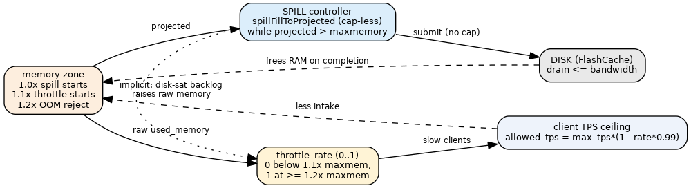

# Throttle & Equilibrium

> A token-bucket client throttler hooked at `readQueryFromClient` (`networking.c:4309`) —
> *before* the command is read/parsed. It reads **raw `used_memory`** and engages only in the
> `[1.1×, 1.2×]` band, slowing client intake as memory rises. It is **decoupled** from the spill
> controller: there is no shared `throttle_rate` knob driving spill concurrency anymore. The two
> controllers couple only **implicitly through memory** — when the disk can't drain, in-flight
> backlog pushes raw `used_memory` up into the throttle band. API:
> [throttle-api](../interfaces/throttle-api.md).

## Token bucket (`:41-72`)

`tb_init` sizes the burst at 50 ms worth of tokens; `tb_setRate` clamps rate ≥ 1 TPS (never
zero — would deadlock, `:49`); `tb_refill` adds `elapsed_ms × tokens_per_ms`; `tb_tryConsume`
takes one token if available. Tunables (`:23-28`): `THROTTLE_ABSOLUTE_MAX_TPS=200000`,
`THROTTLE_MIN_CMD_MAX_TPS=150000`, adjust every `10` commands, `1` ms timer, release ≤ `500`
clients/tick, `1000` ms latency window.

## The gate (`extStorageThrottle_shouldThrottle`, `:257-302`)

Every 10th command it calls `adjustRate` (`:262`). If not throttling → allow (`:265`). A
just-released client (`pending_command`) skips the gate once (`:268-270`). Otherwise FIFO:
if clients are already queued, queue this one too (`:274`); else try a token (`:279-281`). On
throttle (`:289-297`): remove the socket read handler (`connSetReadHandler(c->conn, NULL)`,
`:289`), append to the client queue (`:293`), and ensure the 1 ms timer is running (`:297`).
Returns 1 (defer the command, `:301`).

## Rate adjustment (`extStorageThrottle_adjustRate`, `:188-255`)

1. **Measured max TPS** from the previous 1 s window's *minimum* command latency:
   `measured_max_tps = 1e6 / min_cmd_exec_us` (`:201`), clamped to
   `[THROTTLE_MIN_CMD_MAX_TPS, THROTTLE_ABSOLUTE_MAX_TPS]` (`:206-211`). Fast commands → high
   ceiling; disk-blocked-slow → low ceiling. Latency samples come from
   `recordCommandLatency` (`:169`, fed by `server.c:4017`).
2. **Throttle rate** from **raw `used_memory`** (`:221-230`): `0` at/below `throttle_start =
   maxmemory + maxmemory/10` (**1.1×**, `:221`), `1.0` at/above `throttle_max = maxmemory +
   maxmemory/5` (**1.2×**, `:222`), linear in between (`:230`). The band moved up from
   `[1.0×, 1.1×]` to `[1.1×, 1.2×]`: the spill controller now owns `[1.0×, 1.1×]` alone (no client
   penalty), and the throttle engages only once spilling can no longer hold the line.
3. **Allowed TPS** = `measured_max_tps × (1 − rate × 0.99)`, floored at 1000 (`:246-249`); pushed
   into the bucket via `tb_setRate`. At `rate=0` it resets to the full measured ceiling (`:235-239`).
4. **No spill coupling.** The former `extStorageUpdateSpillConcurrency(rate)` call was **removed**
   (`:252-254`): the throttle no longer drives spill concurrency. The spill controller is cap-less
   and projected-gated ([eviction-integration](eviction-integration.md)); the two are decoupled and
   communicate only implicitly through memory.

## Timer & release (`throttleTimerProc`, `:112-142`)

Every 1 ms: refill, then release up to 500 queued clients while tokens last — each marked
`pending_command` and given its read handler back (`connSetReadHandler(…, readQueryFromClient)`,
`:132`). The timer self-cancels (`AE_NOMORE`) once the queue drains.

## Equilibrium

The throttle is one half of a two-controller system that holds memory near `maxmemory`; the
[spill controller](eviction-integration.md) is the other half, and they share **no** signal —
coupling is implicit through memory:

- **Spill** owns `[1.0×, 1.1×]`: it reads *projected* memory and drains to flash with no cap and
  no client penalty ([memory-accounting](memory-accounting.md)).
- **Throttle** owns `[1.1×, 1.2×]`: it reads *raw* `used_memory` and slows ingress (lower
  `allowed_tps`, clients queued). It engages only when spilling alone can no longer hold the line —
  i.e. when the disk can't drain fast enough and in-flight backlog pushes raw memory past `1.1×`.
- `1.2×` is both the throttle's saturation point (rate = 1.0) and where the
  [eviction override](eviction-integration.md) hard-rejects writes.

So `used_memory − projected` (the in-flight spill backlog) is the implicit disk-saturation signal
that hands control from the spill loop to the throttle. There is no longer a single `throttle_rate`
knob accelerating spills.

## Metrics

`throttle_total_throttled`, `throttle_queued_clients`, `throttle_current_rate`,
`throttle_allowed_tps` ([info-metrics](../interfaces/info-metrics.md)).

See also: [throttle-api](../interfaces/throttle-api.md), [engine-integration](engine-integration.md), [eviction-integration](eviction-integration.md).
