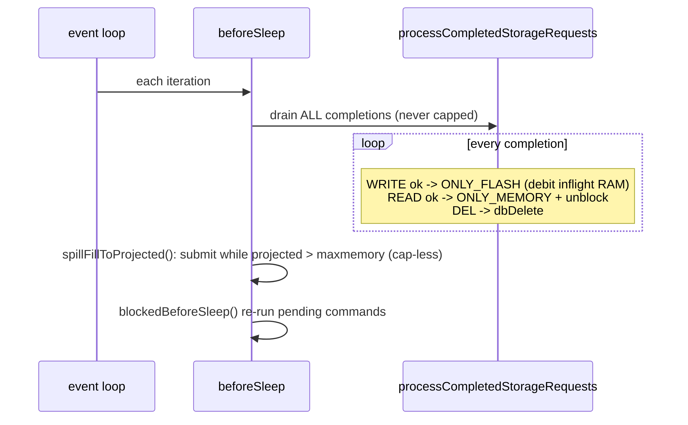
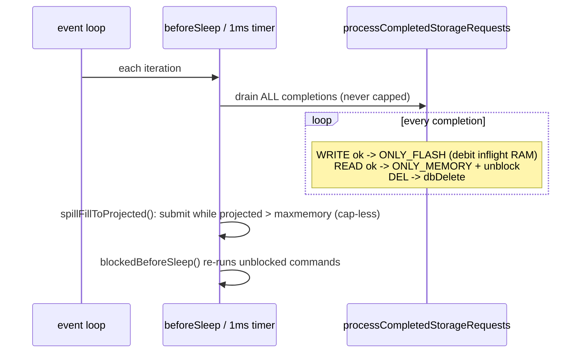

# Completion Drain

> Each event-loop iteration drains **all** backend completions (never capped), applies their
> state transitions, and unblocks waiting clients — then spills if still over `maxmemory`.

Diagram source — <code>diagrams/completion-drain-sequence.mmd</code> (regenerate with <code>make -C ../diagrams seq</code>)

## Where it runs

`processCompletedStorageRequestsAndSpillOldItems` (`:1055-1061`) is invoked from `beforeSleep`
(`server.c:1911`, again `server.c:2036`) and a 1 ms timer (`:311`); it calls
`processCompletedStorageRequests` first (`:1059`), then the cap-less spill controller
`spillFillToProjected`. See [engine-integration](../components/engine-integration.md).

## The drain loop (`processCompletedStorageRequests`, `:602-794`)

`while ((next_batch_size = extStorageBridge_pollCompletions(...)) > 0)` (`:606`) — **uncapped**,
loops until the [bridge](../components/bridge-layer.md) ring is empty. For each completion it
switches on `msg_type`:

- **WRITE** (`:622-686`): first debits the in-flight RAM credit
  (`inflight_spill_ram_bytes -= msg->ram_bytes`, `:625`), then spill result → `ONLY_FLASH` (free
  RAM, tombstone) / `ONLY_MEMORY` (fail, keep value) / delete (`PENDING_EVICT`). See [spill](spill.md).
- **READ** (`:689-751`): restore the fetched robj → `ONLY_MEMORY`, or miss, or discard
  (`PENDING_EVICT`). See [fetch](fetch.md).
- **DELETE** (`:754-785`): `dbDelete` + remove state (or defer/ignore per state). See
  [delete](delete.md).

After the switch, **every** completion ends with `unblockClientsInUseOnKey(key)` (`:792`),
`decrRefCount(key)`, and `zfree(msg)` (`:793-794`).

> **Never cap the drain.** If completions back up, values never get nullified, memory is never
> freed, and the eviction loop blocks every command — so the loop processes the entire ring each
> pass ([state-machine](../components/state-machine.md) transitions depend on this).

Unblocked clients re-execute on the next iteration (`blockedBeforeSleep`), now as RAM hits.

See also: [engine-integration](../components/engine-integration.md), [spill](spill.md), [fetch](fetch.md), [delete](delete.md).
