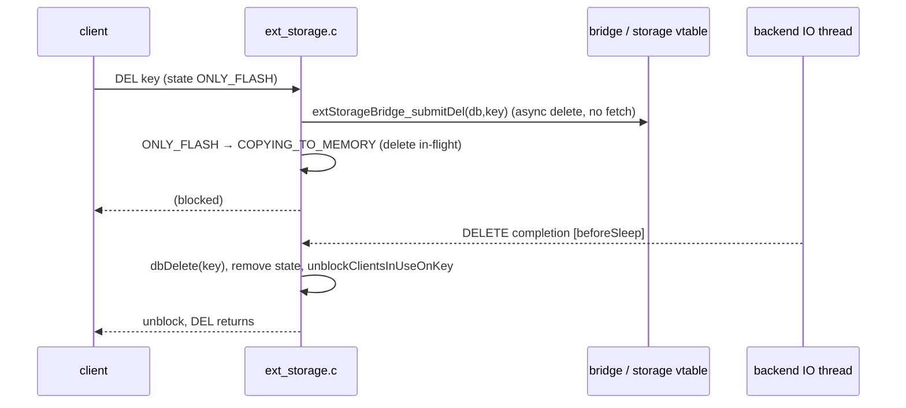

# Delete Flow

> DEL/UNLINK on a flash key issues an **async delete with no fetch** — the value never comes
> back to RAM. The flash copy is dropped first, then the *entry* is deliberately kept alive in
> `TIERING_STATE_PENDING_DELETION` so the client's own re-executed DEL performs the keyspace
> removal with full command-layer side effects:
> `ONLY_FLASH → COPYING_TO_MEMORY (delete in-flight) → PENDING_DELETION`, and the key is
> gone only once that DEL runs again.

> ⚠️ The rendered PNG (and the mermaid source below) predate `TIERING_STATE_PENDING_DELETION`:
> they show the completion doing `dbDelete` and the client unblocking straight into a reply.
> That is the pre-fix behaviour — the DEL-replies-0 bug. `diagrams/delete-sequence.mmd` needs
> regenerating against § 3–4 below; the prose on this page is the authority until it is.

Diagram source — <code>diagrams/delete-sequence.mmd</code> (stale; regenerate with <code>make -C ../diagrams seq</code>)

## The sequence, end to end

### 1. Gate issues the delete — client sees nothing yet

`preCommandExec` (`src/ext_storage.c:573`) flags DEL/UNLINK via `is_delete_cmd`
(`src/ext_storage.c:654`: `c->cmd->proc == delCommand || unlinkCommand`). `keyBlocksClient`
returns 1 for an `ONLY_FLASH` key, so the gate sends `extStorageBridge_submitDel`
(`src/ext_storage.c:710`) — **not** a GET — records msg type `DELETE`, transitions
`ONLY_FLASH → COPYING_TO_MEMORY` (`src/ext_storage.c:723`), sets `c->flag.pending_command`,
calls `blockClientInUseOnKeys` (`src/ext_storage.c:736-737`) and returns `CMD_FILTER_REJECT`
(`src/ext_storage.c:739`). Avoiding the fetch is the point: deleting a value you're about to
discard shouldn't pay a read.

Two adjacent behaviours on the same code path:

- **Expired-TTL reads become deletes.** A `READ` for a key whose expire has already passed is
  converted to a `DELETE` in-place (`src/ext_storage.c:690-706`), skipping a pointless fetch.
  The expire is read off the *entry* robj, never off `objectGetVal(entry)` — that is the
  tiered placeholder sds and would yield a garbage verdict.
- **Backend rejection (throttled)** un-does the block for that key and marks it
  confirmed-absent (`src/ext_storage.c:715-720`).

If a fetch, spill or eviction is **already in flight** the gate issues no new IO at all: the
key is in a `COPYING_*` / `PENDING_*` state, `keyBlocksClient` blocks unconditionally and the
DEL simply queues behind the operation that is already running
(`src/ext_storage.c:489-497`, comment at `src/ext_storage.c:729-730`). The state machine
guarantees at most one in-flight operation per key.

### 2. DELETE completion — the flash copy is gone, the entry is not

`processOneCompletion` handles the `DELETE` message (`src/ext_storage.c:962`) and branches on
the *current* state:

| State at completion | Action |
|---|---|
| `COPYING_TO_FLASH` (`:966-973`) | A spill is still in flight → set `PENDING_EVICT` and defer; the [spill](spill.md) WRITE completion performs the removal. |
| `ONLY_MEMORY` (`:975-979`) | Value was already fetched back → the flash delete is stale, ignore it. |
| entry has an expired TTL (`:986-991`) | `deleteExpiredKeyAndPropagate` — expiry semantics, not DEL semantics. |
| `COPYING_TO_MEMORY` (`:992-1005`) | **Client-initiated DEL.** Keep the entry; set `TIERING_STATE_PENDING_DELETION`. |
| otherwise — GC eviction / `PENDING_EVICT` (`:1006-1008`) | No client is waiting on a reply → `dbDelete` the entry directly. |

Counters bump in all removal cases: `completion_delete_ok`,
`total_items_deleted_from_ext_storage`, `num_items_on_flash--`
(`src/ext_storage.c:1012-1014`). `extStorageRemoveState` runs **unless** the entry was kept for
a pending deletion (`src/ext_storage.c:1011`). Then `unblockClientsInUseOnKey`
(`src/ext_storage.c:1023`) queues the blocked DEL for re-execution — it does not reply.

Why keep the entry: the old code removed it here, so the re-executed DEL found nothing and
replied `0`, with no `signalModifiedKey` (WATCH not invalidated), no keyspace `del`
notification and no dirty increment. That regression is exactly what the DEL-semantics test
suite pins down.

### 3. DEL re-executes at top level and does the real removal

- `keyBlocksClient`'s `PENDING_DELETION` case lets DEL/UNLINK straight through
  (`src/ext_storage.c:499-507`) and blocks everything else.
- The post-gate `TIERED_SAFETY` consistency check in `processCommand` **exempts**
  `PENDING_DELETION` (`src/server.c:4759-4766`). Without the exemption the check would see a
  TIERED placeholder, re-run `preCommandExec` (which now ACCEPTs, installing no block) and
  return — silently dropping the DEL with no reply ever sent.
- `delCommand`/`unlinkCommand` then run normally. `dbGenericDeleteWithDictIndex`
  (`src/db.c:490`) captures `was_pending_deletion` **before** the removal
  (`src/db.c:496-499`), removes the key from `db->keys`/`db->expires`, and frees the value —
  `decrRefCount` for DEL, `freeObjAsync` for UNLINK (`src/db.c:526-530`). The command layer
  supplies the reply count, `signalModifiedKey`, the keyspace `del` notification and the dirty
  increment.
- Finally, `if (was_pending_deletion) unblockClientsInUseOnKey(key)` (`src/db.c:533-534`)
  releases everything that queued behind the draining DEL. Those clients re-execute against
  the post-delete keyspace and see a normal miss.

So the key is freed by the ordinary `dbDelete` path in command context — the completion
handler never frees it for a client DEL.

### 4. Orphan case — the deleting client disappears

If the client that issued the DEL disconnects before its command re-executes, nobody is left
to drain the `PENDING_DELETION` entry. The next command to touch the key detects this: the
`PENDING_DELETION` case asks `blockedInUseClientWithPendingDeleteExists`
(`src/blocked.c:951`, called at `src/ext_storage.c:510`); if no blocked-in-use client on that
key has a pending DEL/UNLINK, the toucher finishes the deletion inline —
`dbDelete` + `signalModifiedKey` + `notifyKeyspaceEvent(... "del" ...)` + dirty increment
(`src/ext_storage.c:511-521`) — and then proceeds against the post-delete keyspace.

## The pending-DEL guard

"Pending-DEL guard" covers two distinct checks, both driven by *blocked-in-use clients whose
pending command is DEL or UNLINK*. Neither inspects tiering state.

| Guard | Predicate | What it refuses / does | Window |
|---|---|---|---|
| **SWAPDB guard** | `blockedInUseDelClientExistsForDbs(id1, id2)` (`src/blocked.c:971-992`), called from `swapdbCommand` (`src/db.c:1918`) | Rejects the command: `-ERR SWAPDB unable to complete, a DEL of a flash-resident key is in progress - please retry`. Reject-and-retry, no partial swap. | From the moment a DEL blocks (`COPYING_TO_MEMORY`) until it drains — covers `PENDING_DELETION` and the pre-completion window alike. |
| **Orphan guard** | `blockedInUseClientWithPendingDeleteExists(key)` (`src/blocked.c:951-962`) | Refuses nothing; decides *who* completes the deletion. Deleter alive → block the caller. Deleter gone → finish the delete inline. | Only while a key sits in `PENDING_DELETION`. |

Why SWAPDB has to be refused rather than fixed up: the blocked DEL re-executes against its
**logical** db index after unblocking. Swapping the contents underneath it would either make it
reply `0` (leaving an orphaned `PENDING_DELETION` placeholder in the other db) or delete a
same-named key out of the swapped-in keyspace (`src/db.c:1908-1917`). Both guards are gated on
`ext_data_enabled`, so tiering-off servers behave exactly as upstream.

Scope notes worth knowing:

- The SWAPDB guard triggers on **any** blocked-in-use DEL/UNLINK targeting either db, not only
  on ones blocked for a flash delete — e.g. a DEL blocked because a spill is in flight also
  refuses the swap. Conservative by construction.
- The guard scans blocked clients, not the keyspace, so a `PENDING_DELETION` entry left behind
  by a disconnected client does **not** block SWAPDB; the orphan guard resolves that entry on
  next touch instead.
- Physical/logical db-id indirection is what makes SWAPDB possible at all for tiered data; see
  [engine-integration](../components/engine-integration.md).

## Interaction with snapshots

`extStorageMaterializeTiered` returns 0 for a `PENDING_DELETION` value
(`src/ext_storage.c:1786-1791`) and bumps `snapshot_tiered_skipped`, so a logically-deleted key
is skipped rather than materialized into the RDB. See
[persistence-replication](../components/persistence-replication.md).

## Eviction reuses the async-delete, not the pending-DEL state

`extStorageEvictFlashKey` (`src/ext_storage.c:1239-1270`) sends `extStorageBridge_submitDel`
for `ONLY_FLASH` (`ONLY_FLASH → COPYING_TO_MEMORY`), or marks
`COPYING_TO_MEMORY → PENDING_EVICT` if a fetch is already in flight, and returns -1 for
`COPYING_TO_FLASH`/`PENDING_EVICT`/`ONLY_MEMORY`. Because no client is waiting on a reply, its
completion takes the direct-`dbDelete` arm — evictions never enter `PENDING_DELETION`. See
[eviction-integration](../components/eviction-integration.md).

> ⚠️ `extStorageEvictFlashKey` currently has **no caller in the tree** — only its declaration
> (`src/ext_storage.h:129`) and definition exist; nothing in `src/`, `modules/` or `tests/`
> invokes it. The behaviour above is what the function does, not a path eviction actually takes
> today. Tracked as issue #21; flagged on
> [eviction-integration](../components/eviction-integration.md), not fixed —
> the wiki does not edit sources.

## Test evidence

Regression suite: tests/unit/data-tiering/ext-storage-del-semantics.tcl (flashcache-mock
backend, `DEBUG SPILL` to force residency on flash). What it pins:

| Assertion | Guards against |
|---|---|
| `DEL` of a flash key replies `1`, then `EXISTS` replies `0` | the replies-0 regression |
| `UNLINK` of a flash key replies `1` | async-free variant takes the same path |
| `DEL flashkey memkey nosuchkey` replies `2` | per-key reply counting across mixed residency |
| `DEL fk1 fk2` (both on flash) replies `2` | multi-key delete, one block per key |
| keyspace del event (__keyevent@*__:del) fires naming the key | notification restored by re-execution |
| a WATCH on the key makes `EXEC` reply nil | `signalModifiedKey` restored |
| a GET arriving mid-drain replies nil, never the placeholder | `PENDING_DELETION` blocking + `src/db.c:533-534` unblock |
| `SET` after the DEL creates a fresh key | no stale flash record shadows the new value |
| `rdb_changes_since_last_save` increases | dirty increment restored |

See also: [engine-integration](../components/engine-integration.md),
[state-machine](../components/state-machine.md),
[ext-storage-api](../interfaces/ext-storage-api.md),
[info-metrics](../interfaces/info-metrics.md), [fetch](fetch.md).
