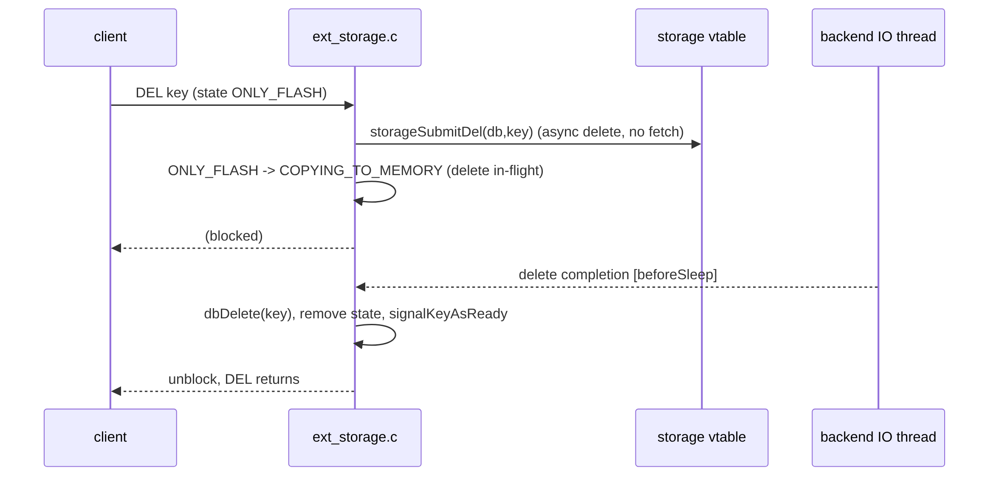
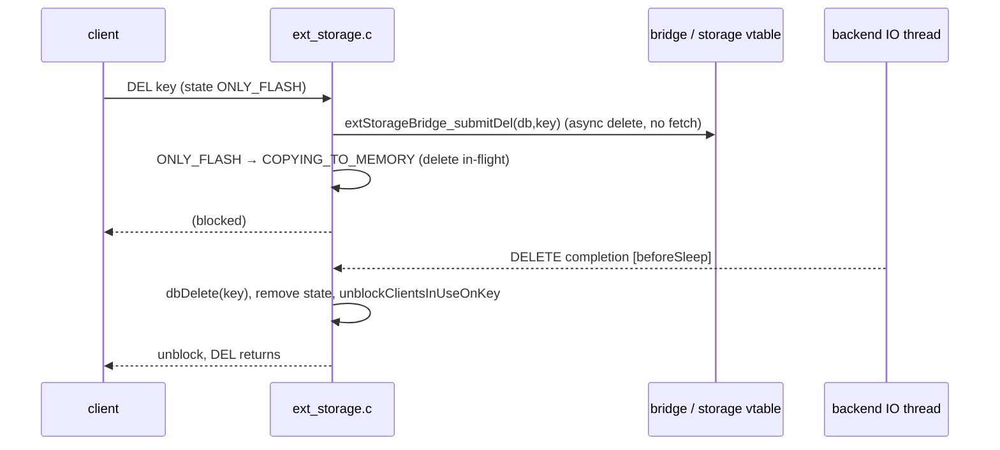

# Delete Flow

> DEL/UNLINK on a flash key issues an **async delete with no fetch** — the value never comes
> back to RAM. `ONLY_FLASH → COPYING_TO_MEMORY (delete in-flight) → key deleted`.

Diagram source — <code>diagrams/delete-sequence.mmd</code> (regenerate with <code>make -C ../diagrams seq</code>)

## 1. Gate issues the delete (`ext_storage.c:455-514`)

`preCommandExec` flags DEL/UNLINK via `is_delete_cmd` (`c->cmd->proc == delCommand ||
unlinkCommand`). For an `ONLY_FLASH` key it sends `extStorageBridge_submitDel(db_id, key)`
(`:488`) — **not** a GET — then transitions to `COPYING_TO_MEMORY` carrying msg type
`DELETE` (`:501`) and blocks the client (`:514`). Avoiding the fetch is the point: deleting a
value you're about to discard shouldn't pay a read.

## 2. DELETE completion (`ext_storage.c:674-708`)

State-dependent (`:677`):

- **COPYING_TO_FLASH** (`:679-685`): a spill is still in flight → set `PENDING_EVICT` and
  defer; the [spill](spill.md) WRITE completion will delete the key.
- **ONLY_MEMORY** (`:688-691`): the value was already fetched back → the flash copy is stale,
  ignore the delete.
- **otherwise** (`ONLY_FLASH`/`COPYING_TO_MEMORY`/`PENDING_EVICT`, `:694-705`): `dbDelete` the
  key, `extStorageRemoveState`, bump `completion_delete_ok` /
  `total_items_deleted_from_ext_storage`, decrement `num_items_on_flash`.

Then `unblockClientsInUseOnKey` (`:714`) and DEL returns to the client. Drain context:
[completion-drain](completion-drain.md).

## Eviction reuses this path

Evicting a flash key uses the same async-delete (no fetch): `extStorageEvictFlashKey`
(`ext_storage.c:797-831`) sends `extStorageBridge_submitDel` for `ONLY_FLASH`
(`ONLY_FLASH → COPYING_TO_MEMORY`), or if a fetch is already in flight marks
`COPYING_TO_MEMORY → PENDING_EVICT`. See [eviction-integration](../components/eviction-integration.md).

See also: [engine-integration](../components/engine-integration.md), [state-machine](../components/state-machine.md), [ext-storage-api](../interfaces/ext-storage-api.md).
