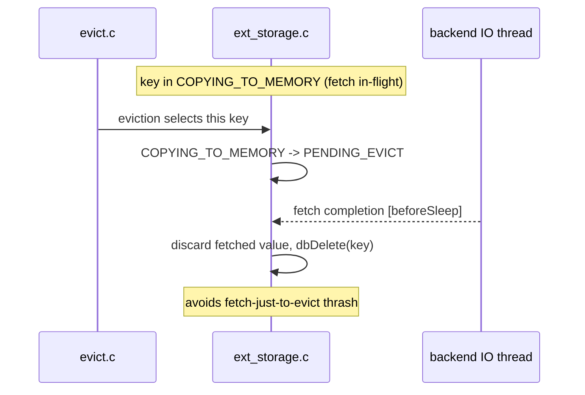

# Evict During Fetch

> `PENDING_EVICT` resolves the race where a key is chosen for eviction (or `DEL`'d) while an op
> is already in flight — it avoids both a fetch-just-to-evict thrash and corrupting an in-flight
> operation. The in-flight op's completion deletes the key instead of promoting/tombstoning it.

Diagram source — <code>diagrams/evict-during-fetch-sequence.mmd</code> (regenerate with <code>make -C ../diagrams seq</code>)

## Entering PENDING_EVICT

| Trigger | Transition | Where |
|---------|-----------|-------|
| eviction of a key whose fetch is in-flight | `COPYING_TO_MEMORY → PENDING_EVICT` | `extStorageEvictFlashKey` (`:814-816`) |
| `DELETE` completion arriving while a spill is in-flight | `COPYING_TO_FLASH → PENDING_EVICT` | `:679-685` |

While `PENDING_EVICT`, `keyBlocksClient` blocks every command on the key
([state-machine](../components/state-machine.md)).

## Resolving on completion

When the in-flight op finishes, the [drain](completion-drain.md) sees `PENDING_EVICT` and
**deletes** rather than completes normally:

- **READ completion** (`:614-629`): `decrRefCount` the fetched value, `dbDelete` the key,
  `extStorageRemoveState`, `total_items_fetching--`. The fetched value is thrown away — never
  promoted into RAM.
- **WRITE completion** (`:556-567`): the spill finished durably, so `dbDelete` the key and
  remove state (the flash copy is now orphaned but the key is gone).

Net effect: the key is deleted with at most one in-flight IO, never an extra fetch just to turn
around and evict. Contrast the normal [fetch](fetch.md) (promote) and [delete](delete.md)
(async delete) paths; selection happens in [eviction-integration](../components/eviction-integration.md).

See also: [state-machine](../components/state-machine.md), [eviction-integration](../components/eviction-integration.md), [fetch](fetch.md).
