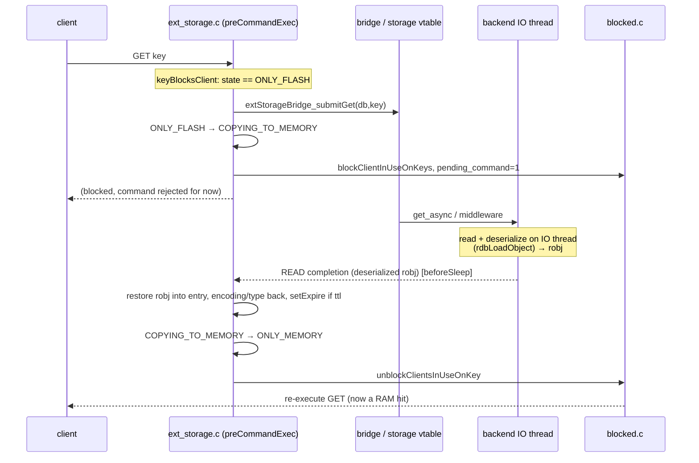

# Fetch Flow

> Flash → memory, `ONLY_FLASH → COPYING_TO_MEMORY → ONLY_MEMORY`. There are **two** fetch
> paths: the default **asynchronous** one (block the client, issue a GET, re-execute the command
> on completion) and a **synchronous** one, `extStorageSyncFetch`, for key accesses that happen
> *mid-command* and therefore cannot be unwound and retried.

Diagram source — <code>diagrams/fetch-sequence.mmd</code> (regenerate with <code>make -C ../diagrams seq</code>)

The diagram covers the **async** path only; there is no diagram for the sync path yet.

## Which path fires

| Access context | Path | Wiring |
|---|---|---|
| Top-level command, keys extractable by `getKeysFromCommand` | **async** (block + re-execute) | `preCommandExec` (`src/ext_storage.c:573-739`) |
| `EXEC`: every key of every queued command, eagerly | **async** | MULTI branch (`src/ext_storage.c:592-645`) |
| Any lookup at `server.execution_nesting > 1` — inside EVAL/FCALL, or a module RM_Call | **sync** | implicit in `lookupKey` (`src/db.c:92-98`) |
| SORT BY / GET pattern-resolved keys | **sync** | explicit `LOOKUP_SYNCFETCH` at `lookupKeyByPattern` (`src/sort.c:116-122`) |
| Module `ValkeyModule_OpenKey` on a tiered key | ⚠️ **neither** — not wired | design phase 2; `LOOKUP_SYNCFETCH` has no other caller |

The two paths are not alternatives for the same access: the async filter stays the default and
sync fetch is strictly the escape hatch for contexts the filter cannot serve.

## 1. Async path — gate issues the fetch (`src/ext_storage.c:573-739`)

In `preCommandExec`, a non-write/non-delete command on an `ONLY_FLASH` key calls
`extStorageBridge_submitGet` (`src/ext_storage.c:712`). On accept it transitions
`ONLY_FLASH → COPYING_TO_MEMORY`, bumps `total_items_fetching_from_ext_storage`
(`src/ext_storage.c:722-726`), sets `c->flag.pending_command` and calls
`blockClientInUseOnKeys` (`src/ext_storage.c:734-737`); the command returns
`CMD_FILTER_REJECT`. If the backend rejects (throttled), the block is undone for that key and
it is marked confirmed-absent (`src/ext_storage.c:715-720`). A key whose TTL has already passed
is turned into a DELETE instead of a fetch (`src/ext_storage.c:690-706`) — see
[delete](delete.md). Gate overview: [engine-integration](../components/engine-integration.md).

`EXEC` is handled by a separate eager branch that walks the keys of *all* queued commands
(`src/ext_storage.c:592-645`), because a key may have spilled between `MULTI` and `EXEC`.

## 2. READ completion (`src/ext_storage.c:834-961`)

The completion carries an already-deserialized robj in `msg->value` (the IO thread ran
`rdbLoadObject`; see [serialization](../components/serialization.md)):

- **`PENDING_EVICT`** (`:837-854`): an eviction arrived while the fetch was in flight; discard
  the fetched value and `dbDelete` the key instead of promoting it — see
  [evict-during-fetch](evict-during-fetch.md).
- **Expired while fetching** (`:862-877`): the entry's expire has passed → drop the value and
  `deleteExpiredKeyAndPropagate` rather than promote a dead value. The expire is read off the
  *entry*, never off the tiered placeholder sds.
- **Value present** (`:858-923`): restore it into the existing entry — free the empty
  placeholder sds, then either copy out to a RAW sds (`hasembval`: the bytes live inside the
  fetched robj's own allocation, so aliasing them would dangle) or transfer the pointer and
  free just the wrapper. Copy `encoding`/`type`, `setExpire` if `msg->ttl > 0`, decrement
  `num_items_on_flash`, `extStorageRemoveState` → `ONLY_MEMORY`.
- **Retry** (`:924-937`): `VALKEYMODULE_EXTERNAL_STORAGE_READ_RETRY` is transient backpressure,
  **not** a miss — resubmit the GET and stay in `COPYING_TO_MEMORY` so blocked clients keep
  waiting. State, counters and blocked clients are all left untouched.
- **Miss** (`:938-956`): the flash copy is genuinely gone (backend GC) → add to
  `keys_confirmed_absent`, remove the state **and** `dbDelete` the TIERED placeholder entry;
  leaving the placeholder behind wedges the gate into an infinite resubmit-miss loop.

Then `total_items_fetching_from_ext_storage--` and `unblockClientsInUseOnKey`
(`src/ext_storage.c:1023`) so the client re-runs the command as a RAM hit. Drain context:
[completion-drain](completion-drain.md).

> SET on an `ONLY_FLASH` key takes the **same fetch path** (it blocks + fetches first, then
> the write applies on re-execution) — the gate only special-cases DEL/UNLINK into the
> [delete flow](delete.md).

## 3. Sync path — `extStorageSyncFetch` (`src/ext_storage.c:1078-1158`)

### Why a synchronous fetch has to exist

The gate can only serve accesses that are (a) knowable before execution and (b) recoverable by
block-and-re-execute. Two access classes fail both prerequisites:

- **Lua undeclared keys.** `redis.call('get', name)` where `name` is computed inside the
  script. The name is unknowable pre-execution, and the script may already have applied writes,
  so there is nothing to unwind — abort-and-retry is not available.
- **`SORT BY` / `GET` patterns.** The weight/data keys derive from the sorted collection's own
  elements and are resolved per element mid-sort in `lookupKeyByPattern`. Before this primitive
  the TIERED placeholder reached the scoring path and crashed (`src/sort.c:116-121`).

Both need the same thing: *the value must become resident right now, mid-command, without
unwinding the command*. Design: `.agent/knowledge/sync-fetch-design.md`.

### Trigger

`lookupKey` calls it when tiering is on, the entry is tiered or in a non-`ONLY_MEMORY` state,
and either `LOOKUP_SYNCFETCH` (`src/server.h:3762`) is set or
`server.execution_nesting > 1` (`src/db.c:92-95`). The call returns `void`; the caller re-finds
the entry afterwards because the fetch replaces the placeholder allocation, and a placeholder
still present on return is reported as an ordinary key miss (`src/db.c:96-97`).

### Loop

| State seen | Action (`src/ext_storage.c:1085-1110`) |
|---|---|
| entry absent | done — absent |
| `ONLY_MEMORY`, not tiered | done — resident |
| `ONLY_MEMORY` but TIERED encoding | normalize to `ONLY_FLASH`, then fetch |
| `PENDING_DELETION` | done — absent (logically deleted; see [delete](delete.md)) |
| `ONLY_FLASH` | `extStorageBridge_submitGet` → `COPYING_TO_MEMORY`; a throttle rejection falls through to drain-and-retry |
| `COPYING_TO_FLASH` / `COPYING_TO_MEMORY` / `PENDING_EVICT` | wait for the in-flight operation. For `COPYING_TO_FLASH` the value is still in RAM, but the caller may mutate it while the IO thread serializes it, so waiting out the [spill](spill.md) and then fetching back is the race-free choice |

Between polls: no-progress backoff of 0 → +50µs steps capped at 200µs
(`src/ext_storage.c:1133-1138`).

### Selective drain — the safety core

While stalled the loop must consume the completion queue to receive *its* key's completion, but
the queue carries other keys' completions too, and running those mid-command mutates the
keyspace under the running command (a spill completion could free a value the SORT vector still
references). So the poll splits the batch (`src/ext_storage.c:1112-1131`): messages for our key
go through the normal `processOneCompletion` handler; everything else is appended to
`deferred_completions` (`src/ext_storage.c:219`) and counted in `sync_fetch_deferred_count`. A
read miss on our own key resolves to absent (`src/ext_storage.c:1131`).

Isolation holds because the event loop does not run during the stall — no other clients, no
timers, no eviction cycle. Unblocking is safe for the same reason: the completion handler's
`unblockClientsInUseOnKey` only *queues* blocked clients for `processUnblockedClients`, so
nothing re-enters inline.

### Drain-ordering rule

`processCompletedStorageRequests` consumes `deferred_completions` **first**, then polls the
bridge (`src/ext_storage.c:1035-1061`, rationale in the comment at
`src/ext_storage.c:1040-1043`): deferred messages were polled out of the bridge earlier, so
they precede anything still queued. Arrival order is preserved; per-key order is safe
regardless, because the state machine allows at most one in-flight operation per key, so
deferring other keys' completions cannot reorder any single key's operations. Cross-key order
carries no semantics. `ext_storage_debug_pause_completions`
(`DEBUG EXT-STORAGE-PAUSE-COMPLETIONS`, tests only) short-circuits the whole drain
(`src/ext_storage.c:1038`).

### No timeout, by design

The loop never gives up: callers cannot roll back partial execution, so the read must complete.
The only concession to a wedged backend is observability — a `LL_WARNING` every 5 s while
stalled, reporting elapsed seconds and the current state
(`src/ext_storage.c:1140-1147`). A wedged backend therefore stalls the whole server; that is an
accepted failure domain, not a bug.

### Metrics

`sync_fetch_count`, `sync_fetch_miss_count`, `sync_fetch_wait_us_total`,
`sync_fetch_wait_us_max`, `sync_fetch_deferred_completions` — accumulated at
`src/ext_storage.c:1150-1157`, exported in `INFO` at `src/ext_storage.c:1563-1567`. See
[info-metrics](../interfaces/info-metrics.md).

> ⚠️ Two documented-vs-code deltas in `.agent/knowledge/sync-fetch-design.md`, code wins: the
> design's signature returns a `dbEntry *` (the shipped one is `void`, `src/ext_storage.h:50`),
> and the design triggers implicitly at `execution_nesting > 0` while the code uses `> 1`.
> Design phase 2 (module `OpenKey` opt-in) is not implemented.

## Blocking commands see both layers

A blocking command on a flash-resident key blocks **twice, in order**: the tiering block from
`preCommandExec` (fetch the value) resolves first, then the command runs and may enter its own
list/stream blocking. Covered by tests/unit/data-tiering/ext-storage-blocking.tcl: BLPOP,
BLMOVE and BLMPOP on flash-resident lists pop immediately after the fetch, and an
`XREAD BLOCK` reader is still woken correctly when the stream spills *while it is blocked* and
a later `XADD` has to fetch it back. The same file asserts `DEBUG OBJECT` reports
`encoding:tiered` plus `value_on_external_storage:1` without crashing, and normal
`serializedlength` output once the value is fetched back.

## Test evidence for the sync path

tests/unit/data-tiering/ext-storage-sync-fetch.tcl (flashcache-mock, `DEBUG SPILL` to force
residency):

| Assertion | Guards against |
|---|---|
| SORT with a BY weight-key pattern over spilled weights sorts correctly and the server survives | the pre-primitive SIGSEGV in the scoring path |
| SORT with both BY and GET patterns returns fetched values | `GET` patterns resolve through sync fetch too |
| SORT with a hash-field pattern (BY wh_*->f) on spilled hashes | hash-field pattern variant |
| Lua `strlen` on an undeclared spilled key returns 300; `get` returns the real bytes | previously read the raw placeholder / defensive-error bytes |
| Lua `append` then `strlen` on a spilled key returns 303 | mid-execution *write* also sync-fetches first |
| Lua read-your-own-write across a spilled key | ordering within a script |
| `EVAL` with an undeclared flash key inside `MULTI`/`EXEC` | nesting-depth trigger inside a transaction |
| `sync_fetch_count > 0` and `sync_fetch_miss_count == 0` | the primitive actually ran, cleanly |
| a top-level command leaves `sync_fetch_count` unchanged | sync fetch stays off the default path |

See also: [engine-integration](../components/engine-integration.md),
[state-machine](../components/state-machine.md),
[ext-storage-api](../interfaces/ext-storage-api.md),
[info-metrics](../interfaces/info-metrics.md), [testing](../components/testing.md),
[spill](spill.md), [delete](delete.md).
