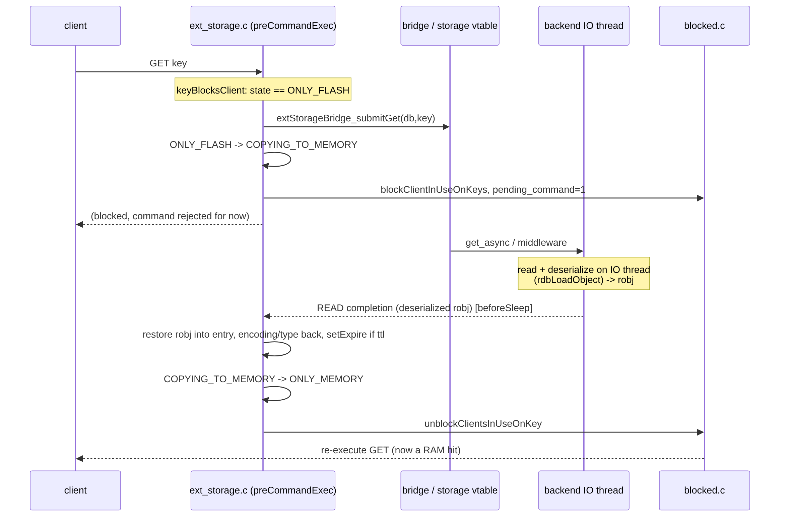
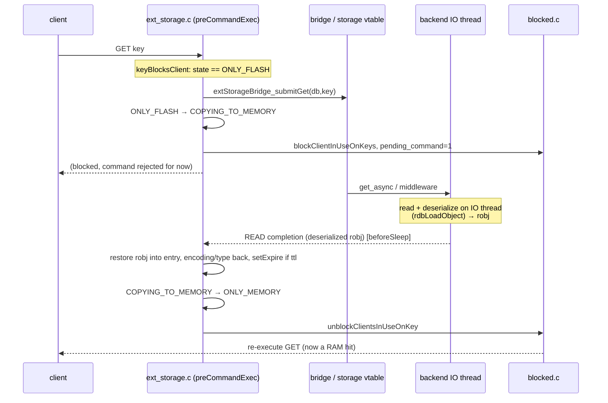

# Fetch Flow

> Flash → memory, `ONLY_FLASH → COPYING_TO_MEMORY → ONLY_MEMORY`. The gate blocks the client
> and issues an async GET; the IO thread reads + deserializes; the completion restores the
> value into the existing entry and unblocks the client to re-execute.

Diagram source — <code>diagrams/fetch-sequence.mmd</code> (regenerate with <code>make -C ../diagrams seq</code>)

## 1. Gate issues the fetch (`ext_storage.c:455-514`)

In `preCommandExec`, a non-write/non-delete command on an `ONLY_FLASH` key calls
`extStorageBridge_submitGet(db_id, key)` (`:490`). On accept it transitions
`ONLY_FLASH → COPYING_TO_MEMORY`, bumps `total_items_fetching_from_ext_storage` (`:500-504`),
and `blockClientInUseOnKeys` (`:514`); the command returns `CMD_FILTER_REJECT`. If the backend
rejects (throttled), the block is undone and the key is marked confirmed-absent (`:493-497`).
Gate overview: [engine-integration](../components/engine-integration.md).

## 2. READ completion (`ext_storage.c:609-672`)

The completion carries an already-deserialized robj in `msg->value` (the IO thread ran
`rdbLoadObject`; see [serialization](../components/serialization.md)):

- **Value present** (`:636-662`): restore it into the existing entry — free the empty
  placeholder sds, `objectSetVal` the fetched value, copy `encoding`/`type`, transfer sds
  ownership (set `new_value->refcount = 0` then `zfree` the wrapper), `setExpire` if
  `msg->ttl > 0`, decrement `num_items_on_flash`, and `extStorageRemoveState` → `ONLY_MEMORY`.
- **Miss** (`:663-669`): value not on disk → add to `keys_confirmed_absent`, remove state.
  (A fetch miss for a written key is treated as fatal in spirit — if a value was written it
  must be readable.)
- **PENDING_EVICT** (`:614-629`): an eviction arrived while the fetch was in flight; discard
  the fetched value and `dbDelete` the key instead of promoting it — see
  [evict-during-fetch](evict-during-fetch.md).

Then `total_items_fetching_from_ext_storage--` and `unblockClientsInUseOnKey` (`:714`) so the
client re-runs the command as a RAM hit. Drain context: [completion-drain](completion-drain.md).

> SET on an `ONLY_FLASH` key takes the **same fetch path** (it blocks + fetches first, then
> the write applies on re-execution) — the gate only special-cases DEL/UNLINK into the
> [delete flow](delete.md).

See also: [engine-integration](../components/engine-integration.md), [state-machine](../components/state-machine.md), [ext-storage-api](../interfaces/ext-storage-api.md).
