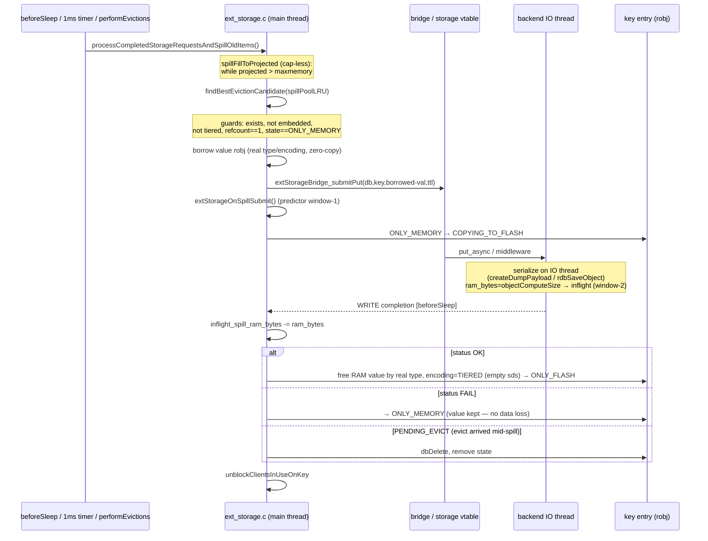

# Spill Flow

> Memory → flash, `ONLY_MEMORY → COPYING_TO_FLASH → ONLY_FLASH`. The main thread selects a
> cold key and submits a **borrowed** value robj; the IO thread serializes and writes; the
> completion frees the RAM value and tombstones the entry.

Diagram source — <code>diagrams/spill-sequence.mmd</code> (regenerate with <code>make -C ../diagrams seq</code>)

## 1. Trigger & candidate selection

Spilling is driven by one **cap-less, projected-gated** controller, `spillFillToProjected`
(`ext_storage.c:1009-1046`), reached from two entry points that now behave identically: the
per-iteration `processCompletedStorageRequestsAndSpillOldItems` (`:1055-1061`) and the
aggressive per-command `…Aggressive` (`:1066-1071`) — both drain completions, then call
`spillFillToProjected()`. The loop runs `while (extStorageProjectedMemory() > server.maxmemory)`
(`:1024`), pulling candidates from `findBestEvictionCandidate(spillPoolLRU,…)` (`:1027`) — the
LRU-sampled pool, detail in [eviction-integration](../components/eviction-integration.md).

There is **no fixed per-tick cap**: queue depth is an emergent output of projected memory. The
old `max_num_concurrent_items_spilled` and throttle-driven `extStorageUpdateSpillConcurrency`
were removed; the `items_spillover_batch_size` variable/config still exists but the cap-less loop
no longer reads it. The loop stops only on setpoint reached
(`projected <= maxmemory`), no spillable candidate (`spill_skipped_null`, `:1028`), or
submit-queue backpressure (`spillItemAsync == -1`, `:1039`). `projected` is the Smith-predictor
estimate (`used_memory` minus spill RAM already committed-to-be-freed) — see
[memory-accounting](../components/memory-accounting.md) and [throttle-equilibrium](../components/throttle-equilibrium.md).

## 2. Submit (`spillItemAsync`, `ext_storage.c:808-868`)

Guards reject the key if it is missing, embedded (`OBJ_ENCODING_EMBSTR`/`INT`), already
`TIERED`, has `refcount != 1`, or is not in `ONLY_MEMORY` (`:813-820`). Otherwise it builds a
lightweight **borrowed** value robj that mirrors the entry's real `type`/`encoding` and points
at the original value with no copy (`:840-844`), submits it via `extStorageBridge_submitPut`
(`:846`), calls `extStorageOnSpillSubmit()` to open the predictor's window-1 (`:861`), and
transitions `ONLY_MEMORY → COPYING_TO_FLASH` (`:864`). Serialization happens later, on the IO
thread — see [serialization](../components/serialization.md).

> During `COPYING_TO_FLASH` the value is still in RAM: GET serves it, SET/DEL block
> ([state-machine](../components/state-machine.md)).

## 3. WRITE completion (`ext_storage.c:622-688`)

First the in-flight RAM credit for this spill is released —
`inflight_spill_ram_bytes -= msg->ram_bytes` (`:625`), the exact footprint the IO thread added
at serialize and carried on the completion msg (closes the predictor's window-2; see
[memory-accounting](../components/memory-accounting.md)). The borrowed robj wrapper is freed with
`zfree` (not `decrRefCount` — the sds is not owned, `:632`). Then:

- **OK** (`:656-675`): free the original in-RAM value by its real type (`createObject` +
  `decrRefCount`, or `objectUnembedVal`), set `encoding = OBJ_ENCODING_TIERED` with an empty
  sds placeholder (`:672-673`), bump `num_items_on_flash` (`:675`), and set `ONLY_FLASH`.
- **FAIL** (`:650-655`): keep the RAM value, `extStorageRemoveState` → `ONLY_MEMORY`. **No
  data loss** — a value that wasn't durably written is never freed.
- **PENDING_EVICT** (`:635-647`): an evict/DEL arrived mid-spill; the write finished, so
  `dbDelete` the key now and remove state.

In all cases `total_items_spilling_to_ext_storage--` and clients are unblocked
(`unblockClientsInUseOnKey`, `:792`). Counters: `spill_*`, `completion_write_*`
([info-metrics](../interfaces/info-metrics.md) via `genExternalStorageInfoString`).

See also: [engine-integration](../components/engine-integration.md), [fetch](fetch.md), [state-machine](../components/state-machine.md).
